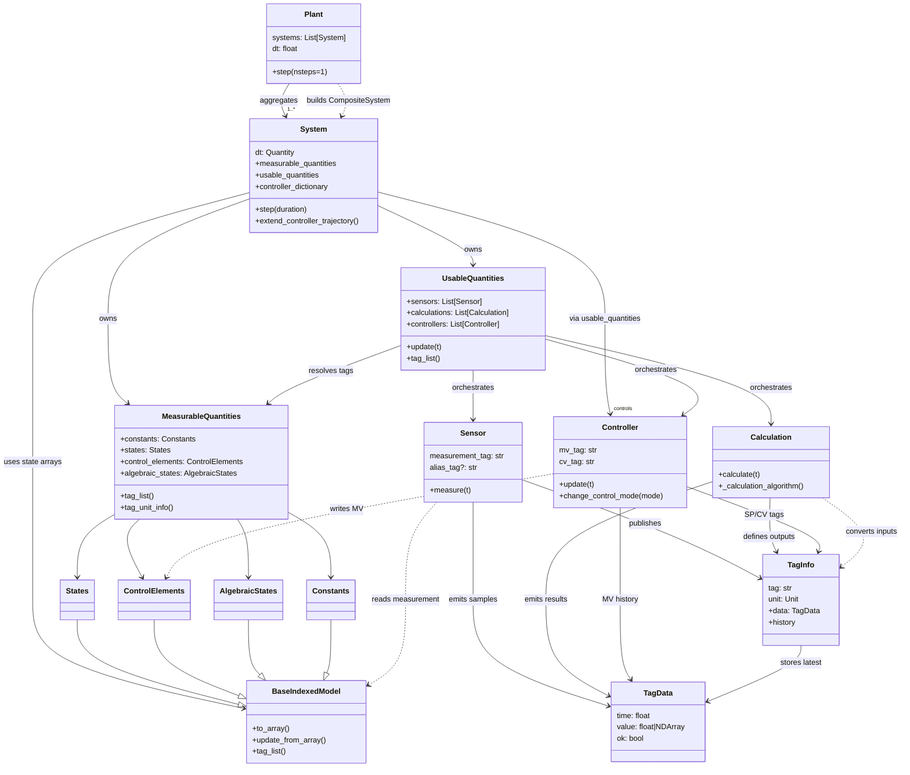

# Modular Simulation Class Wiring

The diagram below captures how the primary orchestration classes compose and depend on one another. It traces the flow from a top-level `Plant` down through `System` orchestration, the measurable/usable quantity containers, and the instrumentation/controller primitives that operate on tags.

## Data flow highlights

1. **Plant aggregation** – A `Plant` flattens the measurable, usable, and controllable artifacts of each constituent `System`, wrapping them into a composite system so the plant can advance every subsystem in lockstep.【F:src/modular_simulation/plant.py†L10-L111】
2. **System orchestration** – `System` owns the measurable/usable containers, refreshes algebraic states, and advances the solver while letting `UsableQuantities` drive sensor measurements, calculations, and controller updates each step.【F:src/modular_simulation/framework/system.py†L24-L382】
3. **Measurable containers** – `MeasurableQuantities` groups `States`, `ControlElements`, `AlgebraicStates`, and `Constants`, each inheriting array-indexing behaviors from `BaseIndexedModel` to enable efficient solver IO.【F:src/modular_simulation/measurables/measurable_quantities.py†L11-L78】【F:src/modular_simulation/measurables/base_classes.py†L8-L118】
4. **Usable orchestration** – `UsableQuantities` initializes and updates `Sensor`, `Calculation`, and `Controller` instances, ensuring tags resolve to measurable data and propagating updates during each simulation tick.【F:src/modular_simulation/usables/usable_quantities.py†L17-L208】
5. **Instrumentation primitives** – Sensors, calculations, and controllers share the `TagInfo`/`TagData` tagging scheme: sensors and calculations publish `TagData` through their `TagInfo`, while controllers coordinate setpoints, cascade relationships, and manipulate control elements via tag-aware getters and setters.【F:src/modular_simulation/usables/sensors/sensor.py†L18-L164】【F:src/modular_simulation/usables/calculations/calculation.py†L52-L182】【F:src/modular_simulation/usables/controllers/controller.py†L62-L405】【F:src/modular_simulation/usables/tag_info.py†L9-L55】

