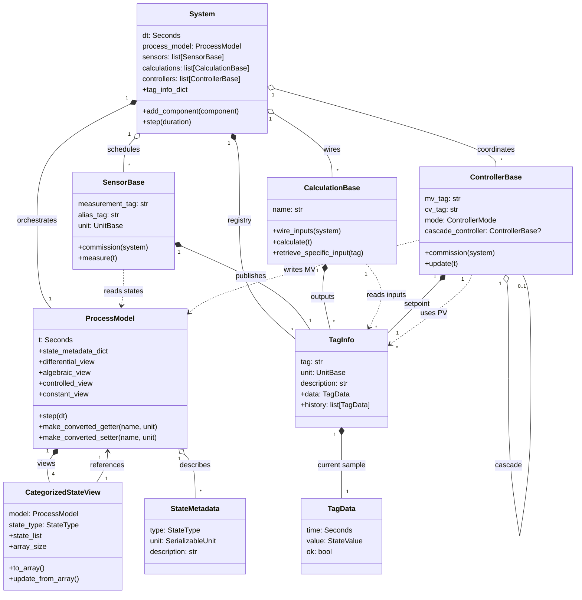

# Modular Simulation Class Wiring (Refactored)

The diagrams in this document capture how the refactored framework wires process models, instrumentation, calculations, and controllers. The focus of the framework overview is the reusable infrastructure, while the example sections highlight calculation and control dependencies unique to each application.

## Framework overview

### Implementation notes

- `System` validates usable components, registers their tag metadata, and advances the coupled process model while running sensors, calculations, and controllers each step.【F:src/modular_simulation/framework/system.py†L24-L212】【F:src/modular_simulation/framework/system.py†L268-L352】
- `ProcessModel` centralizes state metadata, exposes category-specific views for differential/algebraic/controlled/constant states, and handles solver integration plus unit conversions for getters and setters.【F:src/modular_simulation/measurables/process_model.py†L26-L201】【F:src/modular_simulation/measurables/process_model.py†L320-L409】
- `SensorBase` commissions against the process model, resolves measurement getters, and historizes samples on its dedicated `TagInfo` instance.【F:src/modular_simulation/usables/sensors/sensor_base.py†L38-L189】【F:src/modular_simulation/usables/sensors/sensor_base.py†L221-L304】
- `CalculationBase` extracts annotated tag metadata, wires inputs from the system registry, and emits outputs via managed `TagInfo` records.【F:src/modular_simulation/usables/calculations/calculation_base.py†L37-L126】【F:src/modular_simulation/usables/calculations/calculation_base.py†L150-L240】
- `ControllerBase` wires MV setters and CV getters, establishes cascade relationships, and stores setpoint histories in its own `TagInfo` while updating manipulated variables on the process model.【F:src/modular_simulation/usables/controllers/controller_base.py†L49-L213】【F:src/modular_simulation/usables/controllers/controller_base.py†L260-L359】
- `TagInfo` and `TagData` capture the latest value and historized samples for every usable tag, providing uniform access across sensors, calculations, and controllers.【F:src/modular_simulation/usables/tag_info.py†L1-L71】
