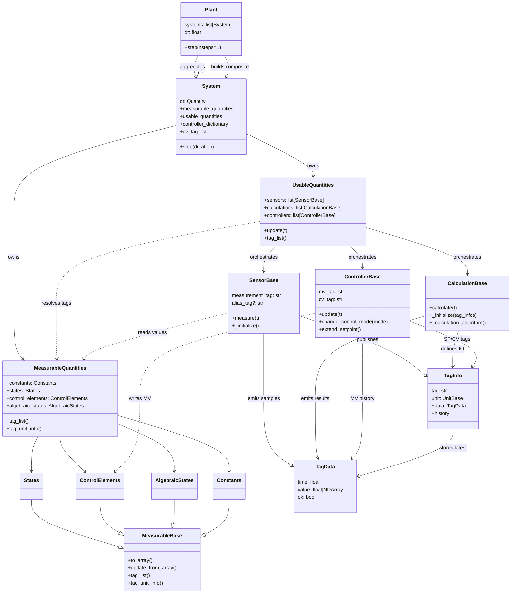

# Modular Simulation Class Wiring

The diagram below captures how the primary orchestration classes compose and depend on one another. It traces the flow from a top-level `Plant` through `System` orchestration, the measurable/usable quantity containers, and the instrumentation/control primitives that operate on tags.

## Data flow highlights

1. **Plant aggregation** – `Plant` flattens measurable and usable artifacts from each constituent `System`, collecting state/control dictionaries, sensors, calculations, controllers, and solver callbacks before wrapping them in a composite system so the plant can advance every subsystem in lockstep.【F:src/modular_simulation/plant.py†L10-L111】
2. **System orchestration** – `System` owns the measurable/usable containers, validates tag wiring, constructs solver parameters, advances the integration loop, and refreshes algebraic states while invoking `UsableQuantities.update` before each solver step to run sensors, calculations, and controllers.【F:src/modular_simulation/framework/system.py†L28-L296】【F:src/modular_simulation/framework/system.py†L401-L555】
3. **Measurable containers** – `MeasurableQuantities` groups `States`, `ControlElements`, `AlgebraicStates`, and `Constants`, each inheriting array-indexing behavior from `MeasurableBase` to provide tag lists, unit metadata, and vector conversions for solver IO.【F:src/modular_simulation/measurables/measurable_quantities.py†L1-L72】【F:src/modular_simulation/measurables/measurable_base.py†L1-L118】
4. **Usable orchestration** – `UsableQuantities` enforces tag consistency, links sensors/calculations/controllers to tag metadata, initializes them against the system's measurables, and executes their `measure`, `calculate`, and `update` hooks every tick.【F:src/modular_simulation/usables/usable_quantities.py†L1-L185】
5. **Instrumentation primitives** – Sensors resolve measurement getters against measurables and stream `TagData` through `TagInfo`, calculations convert input units and produce outputs the same way, and controllers consume those tag infos to manage setpoints and manipulate control elements.【F:src/modular_simulation/usables/sensors/sensor_base.py†L1-L186】【F:src/modular_simulation/usables/calculations/calculation_base.py†L1-L183】【F:src/modular_simulation/usables/controllers/controller_base.py†L1-L195】【F:src/modular_simulation/usables/tag_info.py†L1-L55】
