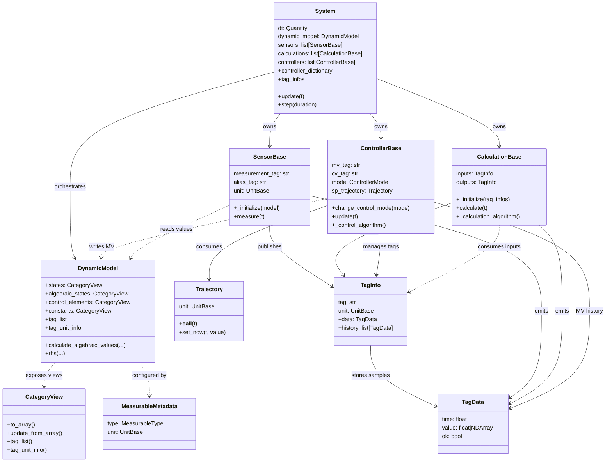

# Modular Simulation Class Wiring

The diagram below captures how the runtime orchestrator, dynamic model, and operator-facing components compose. It focuses on the `System` class, the `DynamicModel` it manages, and the instrumentation/control primitives that exchange tag data at each simulation step.

## Data flow highlights

1. **System orchestration** – `System` owns the dynamic model and its runtime components, validating tag wiring, initializing sensors/calculations/controllers, constructing solver parameters (with optional Numba acceleration), and advancing the integration loop while refreshing histories.【F:src/modular_simulation/core/system.py†L40-L199】
2. **Dynamic model categories** – `DynamicModel` uses `MeasurableMetadata` to map annotated fields into category-specific views (`states`, `algebraic_states`, `control_elements`, `constants`) that provide array conversions, unit metadata, and tag listings for the solver interface.【F:src/modular_simulation/core/dynamic_model.py†L18-L231】
3. **Sensors** – `SensorBase` binds to model tags, performs unit conversion, applies dynamics/noise/fault injection, and publishes `TagInfo` samples for downstream consumers.【F:src/modular_simulation/interfaces/sensors/sensor_base.py†L25-L175】
4. **Calculations** – `CalculationBase` wires annotated input/output tags, builds unit-converting getters, evaluates `_calculation_algorithm`, and records `TagInfo` results while propagating quality flags.【F:src/modular_simulation/interfaces/calculations/calculation_base.py†L19-L183】
5. **Controllers** – `ControllerBase` orchestrates cascade hierarchies, unit conversions, setpoint trajectories, and MV ramping before writing manipulated variables back into the dynamic model.【F:src/modular_simulation/interfaces/controllers/controller_base.py†L30-L205】
6. **Tag metadata** – `TagInfo` and `TagData` capture the latest value, quality, and history for each usable tag, forming the exchange contract between sensors, calculations, and controllers.【F:src/modular_simulation/interfaces/tag_info.py†L8-L55】
