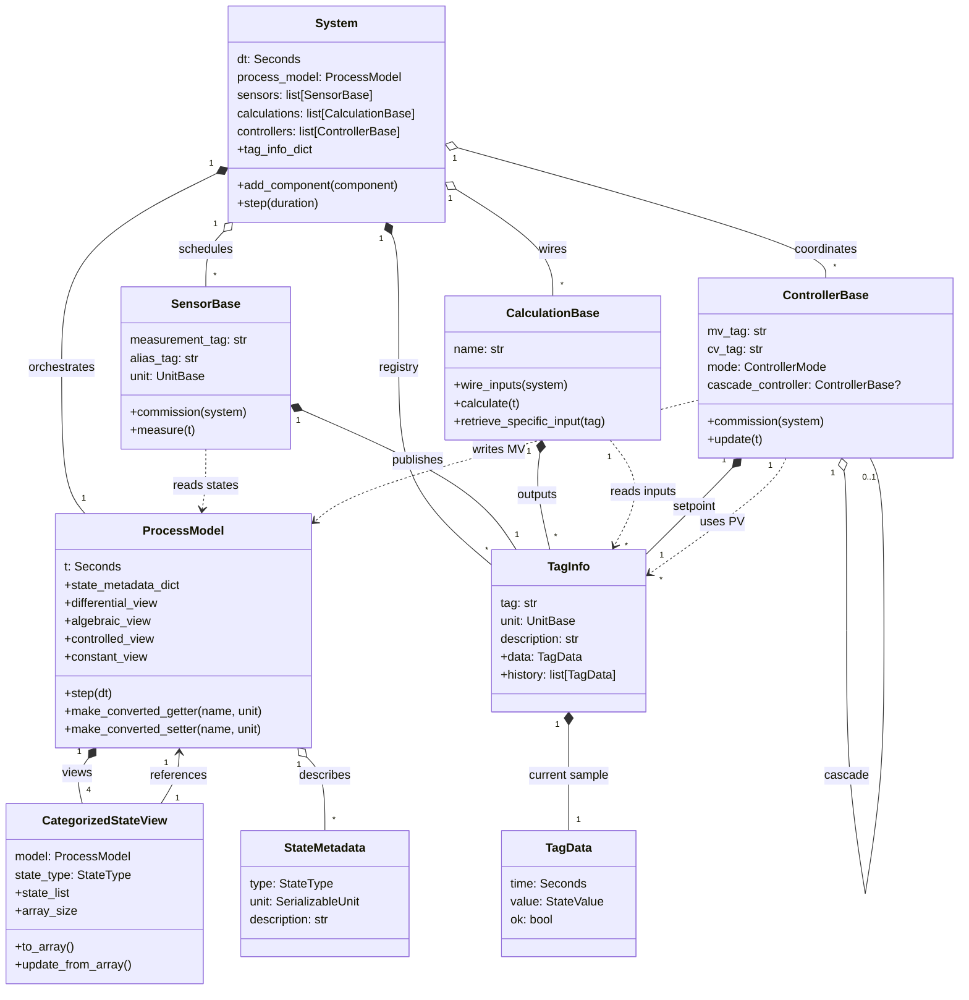
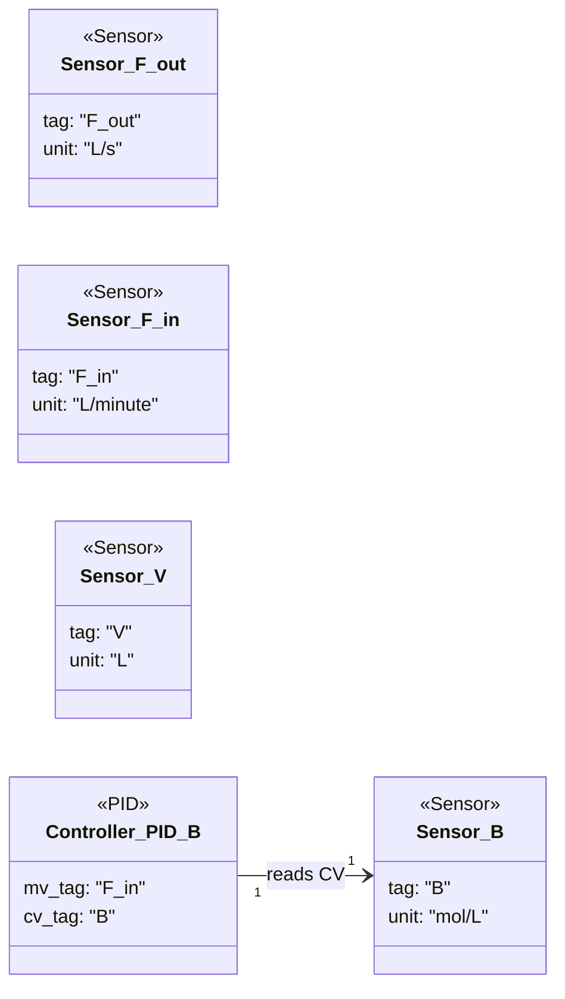
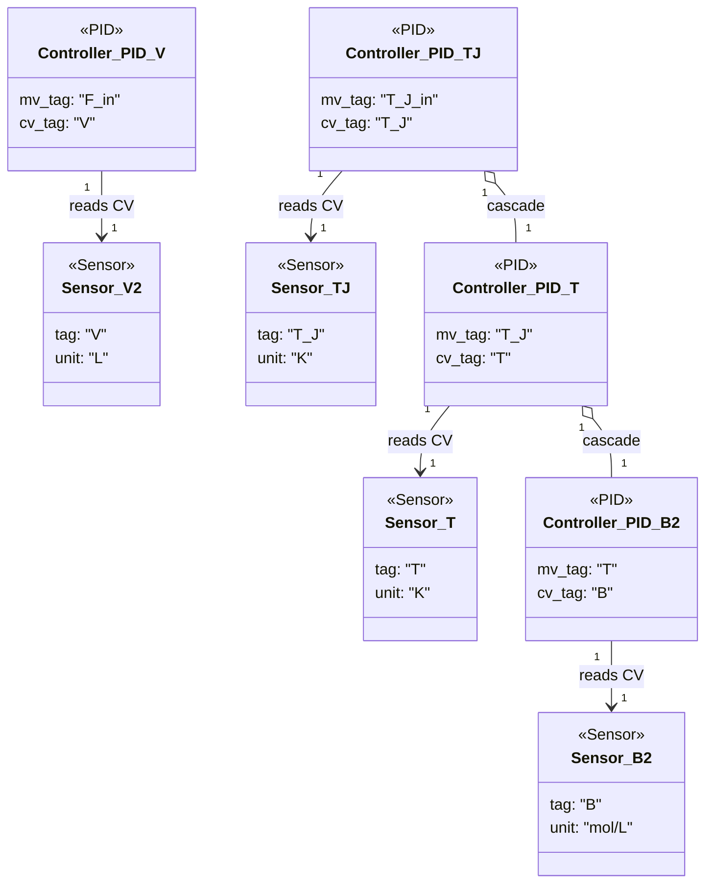
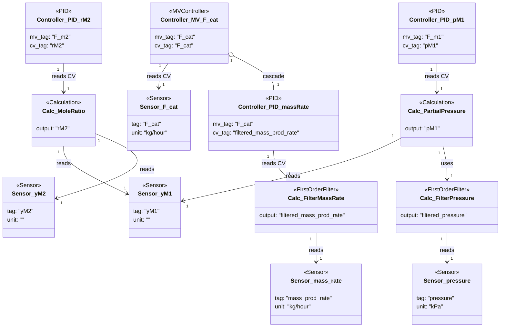
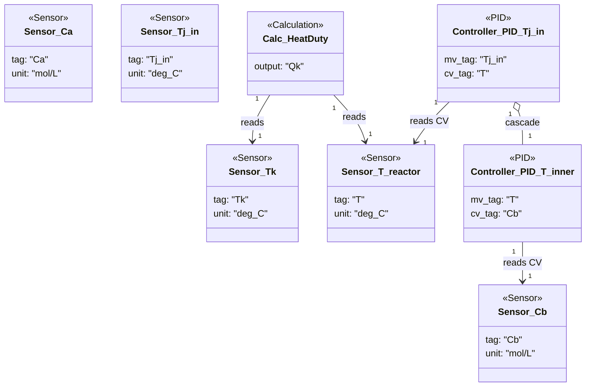

# Modular Simulation Class Wiring (Refactored)

The diagrams in this document capture how the refactored framework wires process models, instrumentation, calculations, and controllers. The focus of the framework overview is the reusable infrastructure, while the example sections highlight calculation and control dependencies unique to each application.

## Framework overview

### Implementation notes

- `System` validates usable components, registers their tag metadata, and advances the coupled process model while running sensors, calculations, and controllers each step.【F:src/modular_simulation/framework/system.py†L24-L212】【F:src/modular_simulation/framework/system.py†L268-L352】
- `ProcessModel` centralizes state metadata, exposes category-specific views for differential/algebraic/controlled/constant states, and handles solver integration plus unit conversions for getters and setters.【F:src/modular_simulation/measurables/process_model.py†L26-L201】【F:src/modular_simulation/measurables/process_model.py†L320-L409】
- `SensorBase` commissions against the process model, resolves measurement getters, and historizes samples on its dedicated `TagInfo` instance.【F:src/modular_simulation/usables/sensors/sensor_base.py†L38-L189】【F:src/modular_simulation/usables/sensors/sensor_base.py†L221-L304】
- `CalculationBase` extracts annotated tag metadata, wires inputs from the system registry, and emits outputs via managed `TagInfo` records.【F:src/modular_simulation/usables/calculations/calculation_base.py†L37-L126】【F:src/modular_simulation/usables/calculations/calculation_base.py†L150-L240】
- `ControllerBase` wires MV setters and CV getters, establishes cascade relationships, and stores setpoint histories in its own `TagInfo` while updating manipulated variables on the process model.【F:src/modular_simulation/usables/controllers/controller_base.py†L49-L213】【F:src/modular_simulation/usables/controllers/controller_base.py†L260-L359】
- `TagInfo` and `TagData` capture the latest value and historized samples for every usable tag, providing uniform access across sensors, calculations, and controllers.【F:src/modular_simulation/usables/tag_info.py†L1-L71】

## Example dependency diagrams

### Simple irreversible system

- Four delayed sensors expose reactor outflow, inflow, concentration, and volume for downstream use.【F:new_examples/simple_irreversible_system/component_definition.py†L11-L34】
- A single PID loop manipulates `F_in` to regulate concentration `B`, consuming the sensor-provided CV tag.【F:new_examples/simple_irreversible_system/component_definition.py†L38-L49】

### Simple irreversible system with energy balance

- Eight sensors provide flow, concentration, temperature, and jacket measurements, enabling multi-loop control and diagnostics.【F:new_examples/simple_irreversible_energy_balance_system/component_definition.py†L10-L31】
- The volume controller directly regulates `V`, while the jacket temperature loop cascades through reactor temperature and concentration controllers, forming a three-tier cascade tree for thermal management.【F:new_examples/simple_irreversible_energy_balance_system/component_definition.py†L35-L61】

### Simplified gas-phase system

- Filters smooth the mass-rate and pressure sensors before downstream consumers rely on the derived tags.【F:new_examples/simplified_gas_phase_system/component_definition.py†L21-L45】
- The mole-ratio and partial-pressure calculations depend on analyzer readings and the filtered pressure, providing CVs for the monomer feed controllers.【F:new_examples/simplified_gas_phase_system/calculation_definition.py†L10-L41】【F:new_examples/simplified_gas_phase_system/component_definition.py†L46-L71】
- An MV controller supervises catalyst feed while cascading to a PID that targets filtered production rate, closing the loop around the derived calculation output.【F:new_examples/simplified_gas_phase_system/component_definition.py†L59-L77】

### Gas-phase polymerization plant

```mermaid
classDiagram
    direction TB
    class Sensor_yM1_full {
        <<Sensor>>
        tag: "yM1"
    }
    class Sensor_yM2_full {
        <<Sensor>>
        tag: "yM2"
    }
    class Sensor_yH2_full {
        <<Sensor>>
        tag: "yH2"
    }
    class Sensor_pressure_full {
        <<Sensor>>
        tag: "pressure"
    }
    class Sensor_mass_rate_full {
        <<Sensor>>
        tag: "mass_prod_rate"
    }
    class Sensor_bed_weight {
        <<Sensor>>
        tag: "bed_weight"
    }
    class Sensor_F_cat_full {
        <<Sensor>>
        tag: "F_cat"
    }
    class Sensor_F_teal {
        <<Sensor>>
        tag: "F_teal"
    }
    class Sensor_lab_MI {
        <<Sensor>>
        tag: "lab_MI"
    }
    class Sensor_lab_density {
        <<Sensor>>
        tag: "lab_density"
    }
    class Sensor_bed_level {
        <<Sensor>>
        tag: "bed_level"
    }

    class Calc_FilterMassRate_full {
        <<FirstOrderFilter>>
        output: "filtered_mass_prod_rate"
    }
    class Calc_FilterPressure_full {
        <<FirstOrderFilter>>
        output: "filtered_pressure"
    }
    class Calc_MoleRatio_full {
        <<Calculation>>
        outputs: "rM2", "rH2"
    }
    class Calc_PartialPressure_full {
        <<Calculation>>
        output: "pM1"
    }
    class Calc_ResidenceTime {
        <<Calculation>>
        output: "residence_time"
    }
    class Calc_CatInventory {
        <<Calculation>>
        output: "cat_inventory"
    }
    class Calc_AlTiRatio {
        <<Calculation>>
        output: "Al_Ti_ratio"
    }
    class Calc_PropertyEstimator {
        <<Calculation>>
        outputs: "inst_MI", "cumm_MI", "inst_density", "cumm_density"
    }

    class Controller_IMC_cat_inventory {
        <<IMC>>
        mv_tag: "F_cat"
        cv_tag: "cat_inventory"
    }
    class Controller_PID_massRate_full {
        <<PID>>
        mv_tag: "cat_inventory"
        cv_tag: "filtered_mass_prod_rate"
    }
    class Controller_PID_pM1_full {
        <<PID>>
        mv_tag: "F_m1"
        cv_tag: "pM1"
    }
    class Controller_PID_rM2_full {
        <<PID>>
        mv_tag: "F_m2"
        cv_tag: "rM2"
    }
    class Controller_IMC_density {
        <<IMC>>
        mv_tag: "rM2"
        cv_tag: "inst_density"
    }
    class Controller_FO_density {
        <<FirstOrderTrajectory>>
        mv_tag: "inst_density"
        cv_tag: "cumm_density"
    }
    class Controller_PID_rH2_full {
        <<PID>>
        mv_tag: "F_h2"
        cv_tag: "rH2"
    }
    class Controller_IMC_MI {
        <<IMC>>
        mv_tag: "rH2"
        cv_tag: "inst_MI"
    }
    class Controller_FO_MI {
        <<FirstOrderTrajectory>>
        mv_tag: "inst_MI"
        cv_tag: "cumm_MI"
    }
    class Controller_IMC_AlTi {
        <<IMC>>
        mv_tag: "F_teal"
        cv_tag: "Al_Ti_ratio"
    }
    class Controller_PID_F_n2 {
        <<PID>>
        mv_tag: "F_n2"
        cv_tag: "filtered_pressure"
    }
    class Controller_PID_F_vent {
        <<PID>>
        mv_tag: "F_vent"
        cv_tag: "filtered_pressure"
    }
    class Controller_BangBang_discharge {
        <<BangBang>>
        mv_tag: "discharge_valve_position"
        cv_tag: "bed_level"
    }

    Calc_FilterMassRate_full "1" --> "1" Sensor_mass_rate_full : reads
    Calc_FilterPressure_full "1" --> "1" Sensor_pressure_full : reads
    Calc_MoleRatio_full "1" --> "1" Sensor_yM1_full : reads
    Calc_MoleRatio_full "1" --> "1" Sensor_yM2_full : reads
    Calc_MoleRatio_full "1" --> "1" Sensor_yH2_full : reads
    Calc_PartialPressure_full "1" --> "1" Sensor_yM1_full : reads
    Calc_PartialPressure_full "1" --> "1" Calc_FilterPressure_full : uses
    Calc_ResidenceTime "1" --> "1" Calc_FilterMassRate_full : uses
    Calc_ResidenceTime "1" --> "1" Sensor_bed_weight : reads
    Calc_CatInventory "1" --> "1" Sensor_F_cat_full : reads
    Calc_CatInventory "1" --> "1" Calc_FilterMassRate_full : uses
    Calc_CatInventory "1" --> "1" Sensor_bed_weight : reads
    Calc_AlTiRatio "1" --> "1" Sensor_F_cat_full : reads
    Calc_AlTiRatio "1" --> "1" Sensor_F_teal : reads
    Calc_PropertyEstimator "1" --> "1" Sensor_mass_rate_full : reads
    Calc_PropertyEstimator "1" --> "1" Sensor_lab_MI : reads
    Calc_PropertyEstimator "1" --> "1" Sensor_lab_density : reads
    Calc_PropertyEstimator "1" --> "1" Calc_ResidenceTime : uses
    Calc_PropertyEstimator "1" --> "1" Calc_MoleRatio_full : uses

    Controller_IMC_cat_inventory "1" --> "1" Calc_CatInventory : reads CV
    Controller_PID_massRate_full "1" --> "1" Calc_FilterMassRate_full : reads CV
    Controller_PID_pM1_full "1" --> "1" Calc_PartialPressure_full : reads CV
    Controller_PID_rM2_full "1" --> "1" Calc_MoleRatio_full : reads CV
    Controller_IMC_density "1" --> "1" Calc_PropertyEstimator : reads CV
    Controller_FO_density "1" --> "1" Calc_PropertyEstimator : reads CV
    Controller_FO_density "1" --> "1" Calc_ResidenceTime : tuning
    Controller_PID_rH2_full "1" --> "1" Calc_MoleRatio_full : reads CV
    Controller_IMC_MI "1" --> "1" Calc_PropertyEstimator : reads CV
    Controller_FO_MI "1" --> "1" Calc_PropertyEstimator : reads CV
    Controller_FO_MI "1" --> "1" Calc_ResidenceTime : tuning
    Controller_IMC_AlTi "1" --> "1" Calc_AlTiRatio : reads CV
    Controller_PID_F_n2 "1" --> "1" Calc_FilterPressure_full : reads CV
    Controller_PID_F_vent "1" --> "1" Calc_FilterPressure_full : reads CV
    Controller_BangBang_discharge "1" --> "1" Sensor_bed_level : reads CV

    Controller_IMC_cat_inventory "1" o-- "1" Controller_PID_massRate_full : cascade
    Controller_PID_rM2_full "1" o-- "1" Controller_IMC_density : cascade
    Controller_IMC_density "1" o-- "1" Controller_FO_density : cascade
    Controller_PID_rH2_full "1" o-- "1" Controller_IMC_MI : cascade
    Controller_IMC_MI "1" o-- "1" Controller_FO_MI : cascade
```

- Analyzer and mass-flow sensors feed multiple derived calculations, including mole ratios, partial pressure, residence time, catalyst inventory, and product property estimators.【F:new_examples/gas_phase_polymerization/component_definition.py†L32-L123】【F:new_examples/gas_phase_polymerization/calculations/misc_calculations.py†L12-L101】【F:new_examples/gas_phase_polymerization/calculations/property_estimator.py†L1-L118】
- Inventory, property, and ratio calculations supply CVs for cascaded IMC, PID, and trajectory controllers that supervise feed flows and quality targets, with inner loops dedicated to product properties and filtered throughput measurements.【F:new_examples/gas_phase_polymerization/component_definition.py†L125-L223】【F:new_examples/gas_phase_polymerization/calculations/misc_calculations.py†L59-L118】【F:new_examples/gas_phase_polymerization/calculations/property_estimator.py†L119-L268】
- Additional loops maintain pressure and solids handling by acting on filtered pressure and bed-level measurements via PID and bang-bang control, respectively.【F:new_examples/gas_phase_polymerization/component_definition.py†L200-L223】

### Van de Vusse CSTR

- Sampled sensors capture concentrations and temperatures for both the reactor and jacket inlet, supplying the calculation and controller CVs.【F:new_examples/van_de_vusse_cstr/component_definition.py†L14-L37】
- The heat-duty calculation computes jacket energy transfer from reactor and jacket temperatures, while an outer PID on `T` cascades to an inner loop that shapes `Cb` via the reactor temperature manipulation.【F:new_examples/van_de_vusse_cstr/calculation_definition.py†L1-L35】【F:new_examples/van_de_vusse_cstr/component_definition.py†L39-L55】
