### Gas-phase polymerization plant

```mermaid
classDiagram
    direction TB
    class Sensor_yM1_full {
        <<Sensor>>
        tag: "yM1"
    }
    class Sensor_yM2_full {
        <<Sensor>>
        tag: "yM2"
    }
    class Sensor_yH2_full {
        <<Sensor>>
        tag: "yH2"
    }
    class Sensor_pressure_full {
        <<Sensor>>
        tag: "pressure"
    }
    class Sensor_mass_rate_full {
        <<Sensor>>
        tag: "mass_prod_rate"
    }
    class Sensor_bed_weight {
        <<Sensor>>
        tag: "bed_weight"
    }
    class Sensor_F_cat_full {
        <<Sensor>>
        tag: "F_cat"
    }
    class Sensor_F_teal {
        <<Sensor>>
        tag: "F_teal"
    }
    class Sensor_lab_MI {
        <<Sensor>>
        tag: "lab_MI"
    }
    class Sensor_lab_density {
        <<Sensor>>
        tag: "lab_density"
    }
    class Sensor_bed_level {
        <<Sensor>>
        tag: "bed_level"
    }

    class Calc_FilterMassRate_full {
        <<FirstOrderFilter>>
        output: "filtered_mass_prod_rate"
    }
    class Calc_FilterPressure_full {
        <<FirstOrderFilter>>
        output: "filtered_pressure"
    }
    class Calc_MoleRatio_full {
        <<Calculation>>
        outputs: "rM2", "rH2"
    }
    class Calc_PartialPressure_full {
        <<Calculation>>
        output: "pM1"
    }
    class Calc_ResidenceTime {
        <<Calculation>>
        output: "residence_time"
    }
    class Calc_CatInventory {
        <<Calculation>>
        output: "cat_inventory"
    }
    class Calc_AlTiRatio {
        <<Calculation>>
        output: "Al_Ti_ratio"
    }
    class Calc_PropertyEstimator {
        <<Calculation>>
        outputs: "inst_MI", "cumm_MI", "inst_density", "cumm_density"
    }

    class Controller_IMC_cat_inventory {
        <<IMC>>
        mv_tag: "F_cat"
        cv_tag: "cat_inventory"
    }
    class Controller_PID_massRate_full {
        <<PID>>
        mv_tag: "cat_inventory"
        cv_tag: "filtered_mass_prod_rate"
    }
    class Controller_PID_pM1_full {
        <<PID>>
        mv_tag: "F_m1"
        cv_tag: "pM1"
    }
    class Controller_PID_rM2_full {
        <<PID>>
        mv_tag: "F_m2"
        cv_tag: "rM2"
    }
    class Controller_IMC_density {
        <<IMC>>
        mv_tag: "rM2"
        cv_tag: "inst_density"
    }
    class Controller_FO_density {
        <<FirstOrderTrajectory>>
        mv_tag: "inst_density"
        cv_tag: "cumm_density"
    }
    class Controller_PID_rH2_full {
        <<PID>>
        mv_tag: "F_h2"
        cv_tag: "rH2"
    }
    class Controller_IMC_MI {
        <<IMC>>
        mv_tag: "rH2"
        cv_tag: "inst_MI"
    }
    class Controller_FO_MI {
        <<FirstOrderTrajectory>>
        mv_tag: "inst_MI"
        cv_tag: "cumm_MI"
    }
    class Controller_IMC_AlTi {
        <<IMC>>
        mv_tag: "F_teal"
        cv_tag: "Al_Ti_ratio"
    }
    class Controller_PID_F_n2 {
        <<PID>>
        mv_tag: "F_n2"
        cv_tag: "filtered_pressure"
    }
    class Controller_PID_F_vent {
        <<PID>>
        mv_tag: "F_vent"
        cv_tag: "filtered_pressure"
    }
    class Controller_BangBang_discharge {
        <<BangBang>>
        mv_tag: "discharge_valve_position"
        cv_tag: "bed_level"
    }

    Calc_FilterMassRate_full "1" --> "1" Sensor_mass_rate_full : reads
    Calc_FilterPressure_full "1" --> "1" Sensor_pressure_full : reads
    Calc_MoleRatio_full "1" --> "1" Sensor_yM1_full : reads
    Calc_MoleRatio_full "1" --> "1" Sensor_yM2_full : reads
    Calc_MoleRatio_full "1" --> "1" Sensor_yH2_full : reads
    Calc_PartialPressure_full "1" --> "1" Sensor_yM1_full : reads
    Calc_PartialPressure_full "1" --> "1" Calc_FilterPressure_full : uses
    Calc_ResidenceTime "1" --> "1" Calc_FilterMassRate_full : uses
    Calc_ResidenceTime "1" --> "1" Sensor_bed_weight : reads
    Calc_CatInventory "1" --> "1" Sensor_F_cat_full : reads
    Calc_CatInventory "1" --> "1" Calc_FilterMassRate_full : uses
    Calc_CatInventory "1" --> "1" Sensor_bed_weight : reads
    Calc_AlTiRatio "1" --> "1" Sensor_F_cat_full : reads
    Calc_AlTiRatio "1" --> "1" Sensor_F_teal : reads
    Calc_PropertyEstimator "1" --> "1" Sensor_mass_rate_full : reads
    Calc_PropertyEstimator "1" --> "1" Sensor_lab_MI : reads
    Calc_PropertyEstimator "1" --> "1" Sensor_lab_density : reads
    Calc_PropertyEstimator "1" --> "1" Calc_ResidenceTime : uses
    Calc_PropertyEstimator "1" --> "1" Calc_MoleRatio_full : uses

    Controller_IMC_cat_inventory "1" --> "1" Calc_CatInventory : reads CV
    Controller_PID_massRate_full "1" --> "1" Calc_FilterMassRate_full : reads CV
    Controller_PID_pM1_full "1" --> "1" Calc_PartialPressure_full : reads CV
    Controller_PID_rM2_full "1" --> "1" Calc_MoleRatio_full : reads CV
    Controller_IMC_density "1" --> "1" Calc_PropertyEstimator : reads CV
    Controller_FO_density "1" --> "1" Calc_PropertyEstimator : reads CV
    Controller_FO_density "1" --> "1" Calc_ResidenceTime : tuning
    Controller_PID_rH2_full "1" --> "1" Calc_MoleRatio_full : reads CV
    Controller_IMC_MI "1" --> "1" Calc_PropertyEstimator : reads CV
    Controller_FO_MI "1" --> "1" Calc_PropertyEstimator : reads CV
    Controller_FO_MI "1" --> "1" Calc_ResidenceTime : tuning
    Controller_IMC_AlTi "1" --> "1" Calc_AlTiRatio : reads CV
    Controller_PID_F_n2 "1" --> "1" Calc_FilterPressure_full : reads CV
    Controller_PID_F_vent "1" --> "1" Calc_FilterPressure_full : reads CV
    Controller_BangBang_discharge "1" --> "1" Sensor_bed_level : reads CV

    Controller_IMC_cat_inventory "1" o-- "1" Controller_PID_massRate_full : cascade
    Controller_PID_rM2_full "1" o-- "1" Controller_IMC_density : cascade
    Controller_IMC_density "1" o-- "1" Controller_FO_density : cascade
    Controller_PID_rH2_full "1" o-- "1" Controller_IMC_MI : cascade
    Controller_IMC_MI "1" o-- "1" Controller_FO_MI : cascade
```

- Analyzer and mass-flow sensors feed multiple derived calculations, including mole ratios, partial pressure, residence time, catalyst inventory, and product property estimators.【F:new_examples/gas_phase_polymerization/component_definition.py†L32-L123】【F:new_examples/gas_phase_polymerization/calculations/misc_calculations.py†L12-L101】【F:new_examples/gas_phase_polymerization/calculations/property_estimator.py†L1-L118】
- Inventory, property, and ratio calculations supply CVs for cascaded IMC, PID, and trajectory controllers that supervise feed flows and quality targets, with inner loops dedicated to product properties and filtered throughput measurements.【F:new_examples/gas_phase_polymerization/component_definition.py†L125-L223】【F:new_examples/gas_phase_polymerization/calculations/misc_calculations.py†L59-L118】【F:new_examples/gas_phase_polymerization/calculations/property_estimator.py†L119-L268】
- Additional loops maintain pressure and solids handling by acting on filtered pressure and bed-level measurements via PID and bang-bang control, respectively.【F:new_examples/gas_phase_polymerization/component_definition.py†L200-L223】