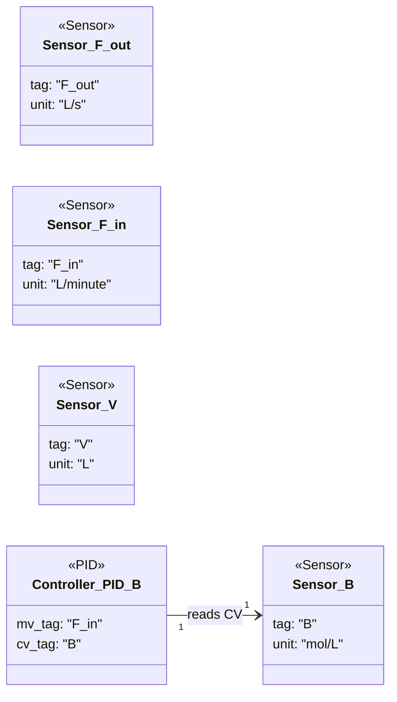

### Simple irreversible system

- Four delayed sensors expose reactor outflow, inflow, concentration, and volume for downstream use.【F:new_examples/simple_irreversible_system/component_definition.py†L11-L34】
- A single PID loop manipulates `F_in` to regulate concentration `B`, consuming the sensor-provided CV tag.【F:new_examples/simple_irreversible_system/component_definition.py†L38-L49】