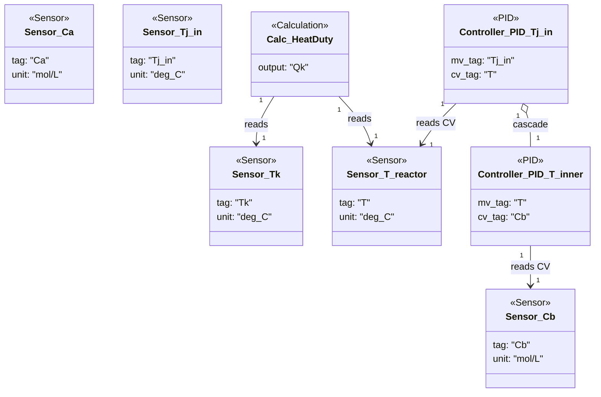

### Van de Vusse CSTR

- Sampled sensors capture concentrations and temperatures for both the reactor and jacket inlet, supplying the calculation and controller CVs.【F:new_examples/van_de_vusse_cstr/component_definition.py†L14-L37】
- The heat-duty calculation computes jacket energy transfer from reactor and jacket temperatures, while an outer PID on `T` cascades to an inner loop that shapes `Cb` via the reactor temperature manipulation.【F:new_examples/van_de_vusse_cstr/calculation_definition.py†L1-L35】【F:new_examples/van_de_vusse_cstr/component_definition.py†L39-L55】