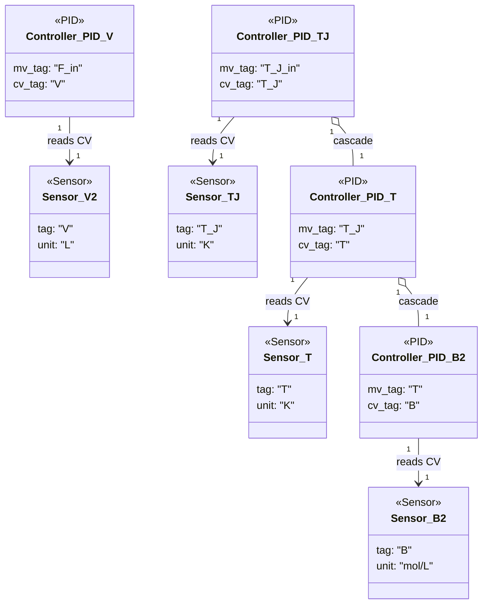

### Simple irreversible system with energy balance

- Eight sensors provide flow, concentration, temperature, and jacket measurements, enabling multi-loop control and diagnostics.【F:new_examples/simple_irreversible_energy_balance_system/component_definition.py†L10-L31】
- The volume controller directly regulates `V`, while the jacket temperature loop cascades through reactor temperature and concentration controllers, forming a three-tier cascade tree for thermal management.【F:new_examples/simple_irreversible_energy_balance_system/component_definition.py†L35-L61】

