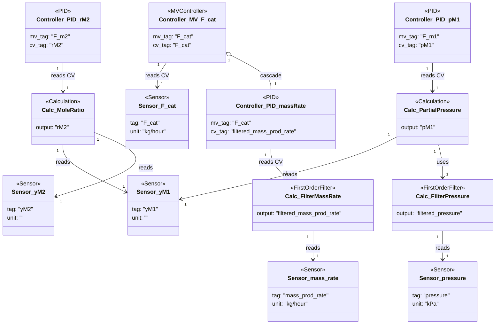

### Simplified gas-phase system

- Filters smooth the mass-rate and pressure sensors before downstream consumers rely on the derived tags.【F:new_examples/simplified_gas_phase_system/component_definition.py†L21-L45】
- The mole-ratio and partial-pressure calculations depend on analyzer readings and the filtered pressure, providing CVs for the monomer feed controllers.【F:new_examples/simplified_gas_phase_system/calculation_definition.py†L10-L41】【F:new_examples/simplified_gas_phase_system/component_definition.py†L46-L71】
- An MV controller supervises catalyst feed while cascading to a PID that targets filtered production rate, closing the loop around the derived calculation output.【F:new_examples/simplified_gas_phase_system/component_definition.py†L59-L77】