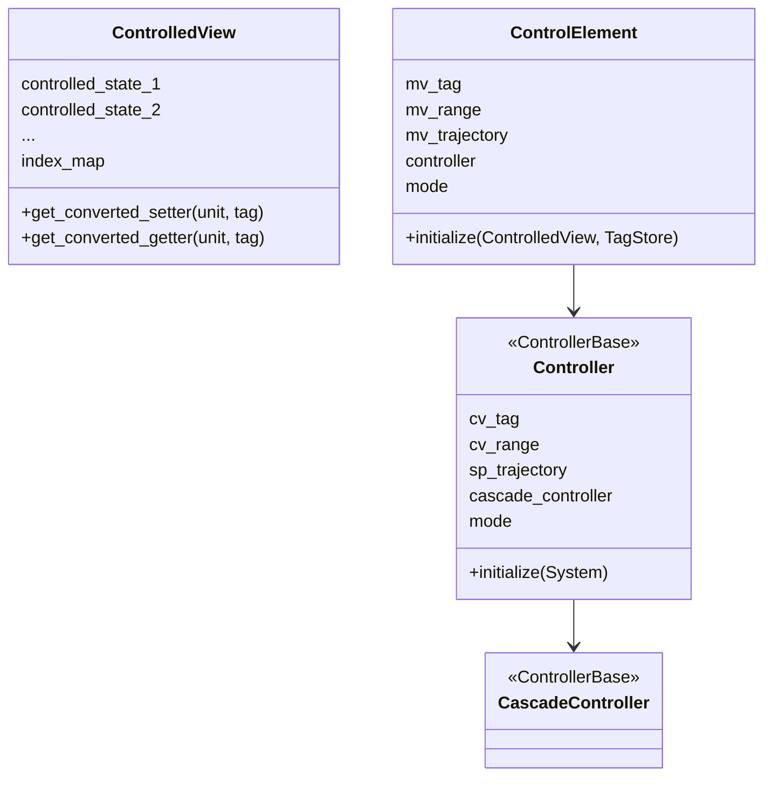

```mermaid
classDiagram
    direction TB
    class ControlledView {
        controlled_state_1
        controlled_state_2
        ...
        index_map
        +get_converted_setter(unit, tag)
        +get_converted_getter(unit, tag)
    }
    class ControlElement {
        mv_tag
        mv_range
        mv_trajectory
        controller
        mode
        +initialize(ControlledView, TagStore)
    }
    class Controller {
        <<ControllerBase>>
        cv_tag
        cv_range
        sp_trajectory
        cascade_controller
        mode
        +initialize(System)
    }
    class CascadeController{
        <<ControllerBase>>
    }
    ControlElement -->  Controller
    Controller --> CascadeController
```
